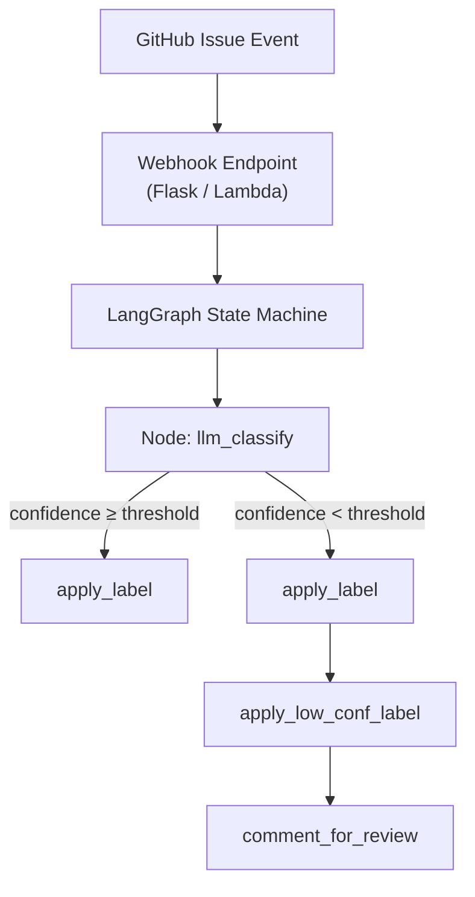

# pl-triageAgent – GitHub Issue Triage Bot

---

An open-source, container-ready service that automatically classifies GitHub issues into **Bug**, **Enhancement** or **Question**, then labels them accordingly.  
It combines **OpenAI GPT-4.1** for natural-language understanding with **LangGraph** for deterministic workflow orchestration, and ships with both a **Flask** webhook server and an **AWS Lambda** handler.

## ✨ Key Features
- **LLM-powered classification** – Uses GPT-4.1 with zero-temperature prompts for consistent outputs.
- **Confidence-aware routing** – Low-confidence results trigger an extra label and a maintainer ping.
- **Stateless orchestration via LangGraph** – Declarative node/edge graph with explicit state typing.
- **Pluggable deployment** – Run locally with Docker, deploy as a Lambda container, or host on any OCI-compatible platform.

---

## 🏗️ Architecture Overview



### 1. Entry Points
* **`app/main.py`** – Flask server exposing `/webhook` for GitHub's *issues* events.  
* **`app/lambda_handler.py`** – AWS Lambda–style handler so the same codebase can be shipped as a Lambda container.

### 2. Orchestration with LangGraph (`app/graph.py`)
| Concept | Implementation |
|---------|----------------|
| **State** | TypedDict `IssueState` holding the issue's title, body, number, predicted classification and confidence. |
| **Nodes** | • `llm_classify` – calls OpenAI chat completion.<br/>• `apply_label`, `apply_low_conf_label`, `comment_for_review` – lightweight GitHub API helpers from `utils.py`. |
| **Router** | `route_on_conf` evaluates the LLM confidence score and returns a list of next edges. |
| **Graph** | Declared via `StateGraph(IssueState)` then compiled once at import time. |

### 3. External Integrations
* **OpenAI API** – Invoked through `openai` v1 SDK, key taken from `OPENAI_API_KEY` env var.
* **GitHub REST API** – Minimal wrapper in `utils._github_request`, authenticated with `GH_TOKEN`.

---

## 🚀 Getting Started

### Prerequisites
1. Python ≥ 3.10 (only for local dev – Docker image includes 3.12).  
2. Docker Desktop (or any OCI-compatible runtime).

### Environment Variables
Create a `.env` file in the project root (ignored by Git) and set:

```bash
OPENAI_API_KEY=<your-openai-key>
GH_TOKEN=<github-personal-access-token>
REPO_OWNER=<repo owner e.g. "octocat">
REPO_NAME=<repo name  e.g. "hello-world">
# Optional
CONF_THRESHOLD=0.8            # default
GH_WEBHOOKSECRET=...          # if you want HMAC verification
ENABLE_NGROK=true             # expose local server
```

### Local Development
```bash
# Install deps
python -m venv .venv && source .venv/bin/activate
pip install -r triage-agent/requirements.txt

# Run Flask server
python triage-agent/app/main.py  # listens on :8000 by default
```

### Docker
Build and run the container (the Dockerfile is Lambda-optimised but works anywhere):
```bash
docker build -t pl-gitissuelabler:latest -f triage-agent/Dockerfile .

docker run --rm -p 8000:8000 \
  -e OPENAI_API_KEY -e GH_TOKEN -e REPO_OWNER -e REPO_NAME \
  pl-gitissuelabler:latest
```

### AWS Lambda (Container Image)
1. Build the same image and push to ECR.
2. Create a Lambda *container image* function with handler `app.lambda_handler.handler` (already set in `CMD`).
3. Point your GitHub webhook URL to the Lambda Function URL or API Gateway endpoint.

---

## 🧪 Testing Without GitHub
`triage-agent/test_run.py` provides an offline harness that:
1. Loads the `.env` file.
2. Stubs GitHub API calls to avoid network requests.
3. Invokes the Lambda handler with a sample payload.

Run it via `python triage-agent/test_run.py` to see JSON output verifying the graph execution.

---

## 📂 Project Structure
```
triage-agent/
  ├── app/
  │   ├── graph.py            # LangGraph workflow
  │   ├── utils.py            # GitHub REST helpers
  │   ├── settings.py         # Env-var configuration
  │   ├── main.py             # Flask webhook server
  │   ├── lambda_handler.py   # AWS Lambda adapter
  │   └── __init__.py
  ├── requirements.txt        # Python dependencies
  └── test_run.py             # Offline test harness
```

---

## 🔧 Extending LangGraph
Adding new steps is as simple as:
1. Writing a Python function that accepts `(state_dict, context)` and returns a partial state update.
2. Registering it via `builder.add_node("your_node", your_func)`.
3. Adding edges or conditional logic.

LangGraph will merge returned dictionaries into the global state, making incremental enrichment trivial.

---

## 🛡️ Security & Secrets
This repo never stores secrets in code; everything is sourced via environment variables.  
`.gitignore` and `.dockerignore` both exclude `.env*`, certificates and other sensitive files.

---

## 📜 License
MIT – see `LICENSE` (or update as appropriate).
